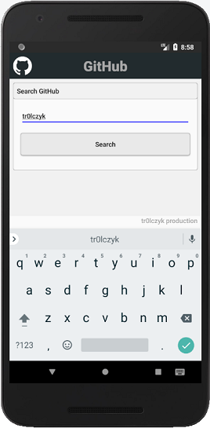
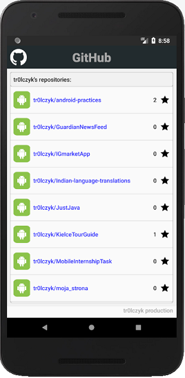
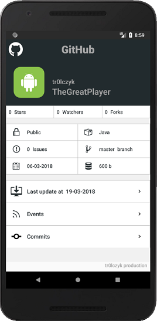

myGithubClient
===================================

Application is a github repository viewer! Till now that is my most advanced project :) App takes in the any username provided by the actual user and connects with the github API to search if the "inputUser" exist. If there is no one with that name it asks for another input(through the AlertDialog). If there is no internet connection, a toast message appears informing of that fact. If the user exist and there is a connection, app's retriving the information on each repo and displays them in the ArrayList (in a new fragment) that is using modified ArrayAdapter to display and recycle views on the xml layout. User can also click the listItem and check the repository information (like the size, issues, updates of the repo) opening in another fragment. For the xml layout files I used the constraintLayout containers. All used images have different densities, used dependently on the device screen size. App is using loaders to connect asynchronously with API.

If you want to see the app in action, please follow this link: https://tr0lczyk.tinytake.com/sf/MjU5NDU2M183ODA3NzU4

The application looks like that:

